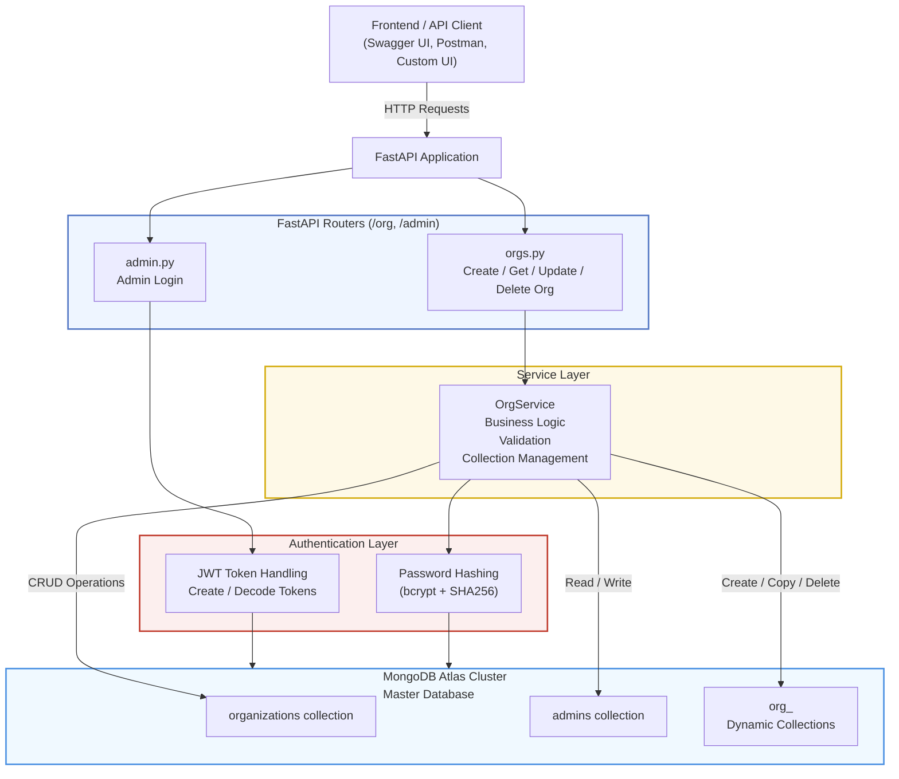
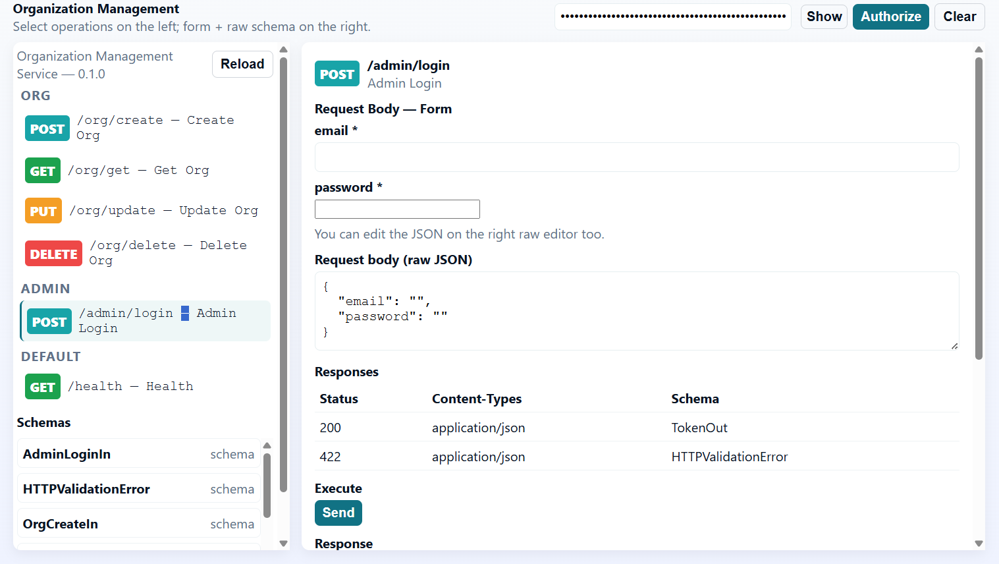
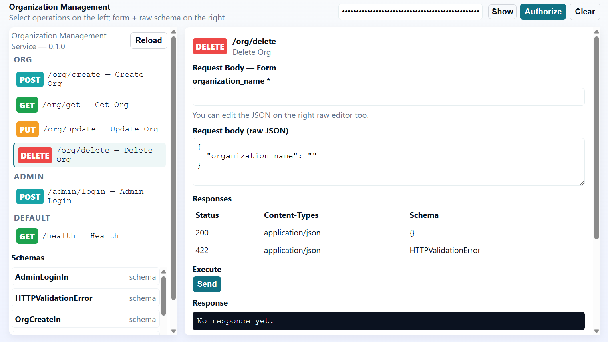
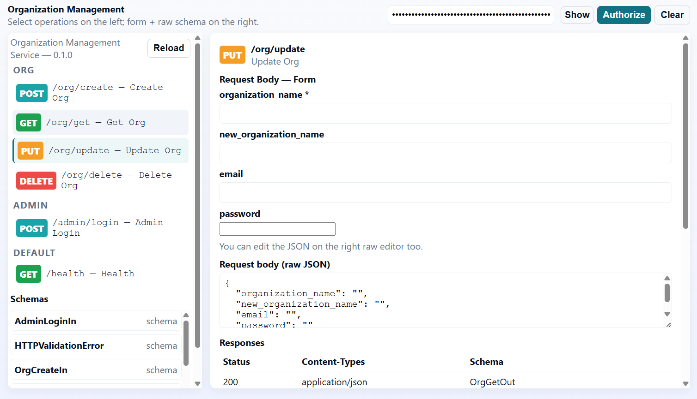

# Accessing the Service

You can access the service using the link below:
https://organization-management-service-rjwy.onrender.com/static/ui.html

How to Use the APIs

1. Create an organization and admin: Use the POST endpoint to add a new organization along with its admin details.

2. Fetch organization details: The GET endpoint is public. If you know the organization name, you can retrieve its details without authentication.

3. Admin login and token generation: Go to the Admin section and log in using the admin email and password of the respective organization. On successful login, a Bearer token is generated and saved automatically.

4. Authorized operations (Update and Delete): The generated Bearer token is required to perform protected operations such as PUT (update) and DELETE.

5. As long as the token is valid, the admin can update or delete their organization.


# Organization Management Service

A FastAPI-based backend service designed for **multi-tenant organization management**.  
The system dynamically provisions MongoDB collections per organization and supports secure admin authentication using JWT.

---

## 1. Overview

The **Organization Management Service** is a FastAPI-based backend system designed for a **multi-tenant architecture**.  
It allows creating and managing organizations dynamically by generating **dedicated MongoDB collections per organization**.

The service includes:
- Organization CRUD operations
- Secure admin authentication using JWT
- Cloud-ready deployment support

---
## Architecture




## 2. Key Features

- Dynamic creation of organizations with unique MongoDB collections
- Secure admin authentication (JWT-based)
- Update organization names with automatic MongoDB collection migration
- Delete organizations along with their respective admin users
- Modular and maintainable code structure (routers, services, database layers)
- Production-ready and Render-deployable

---

## 3. Tech Stack

- **Language**: Python 3
- **Framework**: FastAPI
- **Database**: MongoDB
- **Async Driver**: Motor
- **Authentication**: JWT (JSON Web Tokens)
- **Deployment**: Render

---

## 4. Project Structure

```
app/
├── api/
│   └── v1/
│       ├── orgs.py
│       └── admin.py
├── core/
│   ├── auth.py
│   └── config.py
├── db/
│   └── mongo.py
├── models/
│   └── schemas.py
├── services/
│   └── org_service.py
└── main.py
```

---

## 5. API Endpoints

### Organization Management

| Method | Endpoint        | Description |
|------|-----------------|-------------|
| POST | `/org/create`   | Create a new organization |
| GET  | `/org/get`      | Fetch organization details |
| PUT  | `/org/update`   | Update organization details |
| DELETE | `/org/delete` | Delete organization (JWT required) |

### Admin Authentication

| Method | Endpoint        | Description |
|------|-----------------|-------------|
| POST | `/admin/login`  | Authenticate admin and generate JWT |

---

## 6. Environment Variables (.env)

```
MONGO_URI=
MASTER_DB=organization_master_db
JWT_SECRET=some_long_secret_key
JWT_ALGORITHM=HS256
ACCESS_TOKEN_EXPIRE_MINUTES=1440
```

> **Note:**  
> `MONGO_URI` should be a valid MongoDB Atlas connection string with permission to create and manage collections.

---

## 7. Running Locally

### 1. Install Dependencies

```
pip install -r requirements.txt
```

### 2. Configure Environment Variables

Ensure all required environment variables are set using a `.env` file.

### 3. Start the Server

```
uvicorn app.main:app --reload
```

The API will be available at:
```
http://localhost:8000
```

Swagger documentation:
```
http://localhost:8000/docs
```

---


## 9. Screenshots

The following screenshots are included in the repository under the `screenshots/` directory and are rendered directly below for reference.

### UI - POST ORG / API DETAILS



### UI - GET ORG / API DETAILS



### UI - PUT ORG / API DETAILS



### UI - DELETE ORG / API DETAILS


### UI - ADMIN POST / API DETAILS


---

## 10. Security Notes

- JWT tokens are securely signed using a secret key
- Token expiration is configurable
- Admin-only endpoints are protected
- Database credentials must never be committed to version control

---

## 11. License

This project is intended for educational, demonstration, or internal use.  
You may extend or adapt it for production deployments as required.
